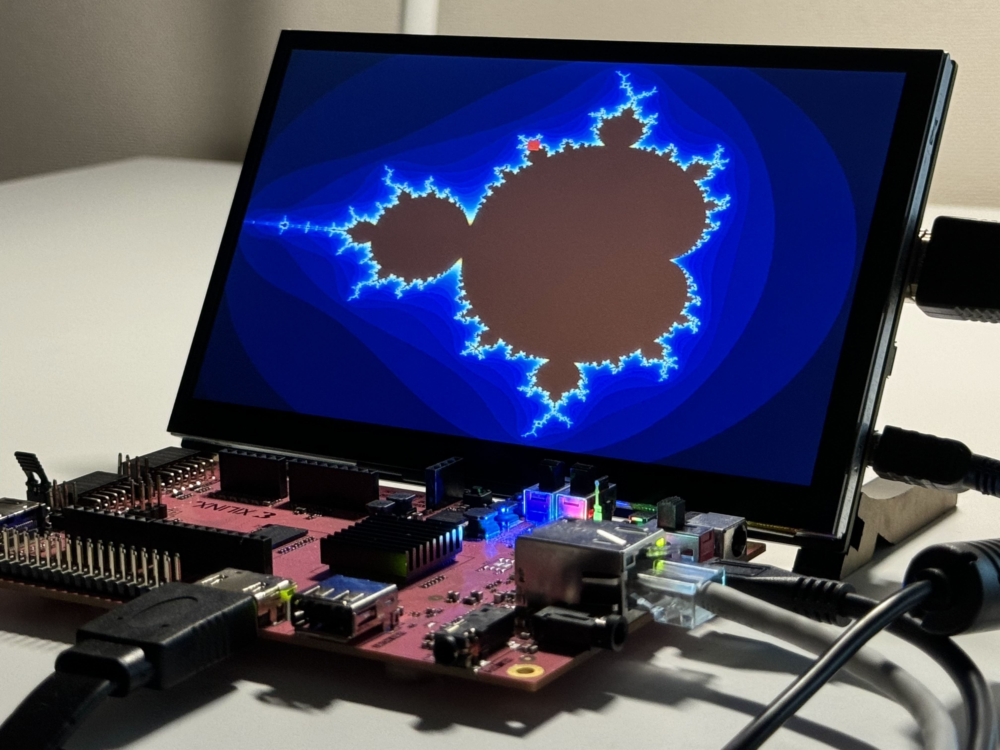

# fpga-mandelbrot
A simple Verilog implementation of the [Mandelbrot set](https://en.wikipedia.org/wiki/Mandelbrot_set) explorer for the PYNQ-Z2 development board.

### Specifications
- 800x600p60 HDMI display
- 26-bit fixed-point architecture
- Rendered using the escape time algorithm
- Zooming in and out available

### Acknowledgements
- Referenced the [Project F display controller](https://github.com/projf/display_controller) (published under the [MIT License](https://github.com/projf/display_controller/blob/master/LICENSE)) to add HDMI video output
